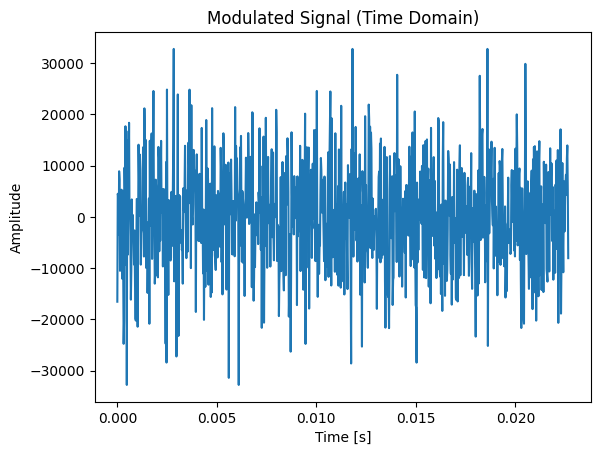
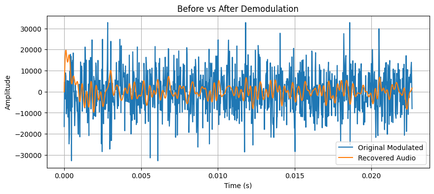

# 🎧 Modulated Audio Signal Processing

This repository contains my solution to the **Modulated Audio Signal Processing** task using Python. The goal was to demodulate a given AM (Amplitude Modulated) audio signal, clean it using a bandpass filter, and recover the original audio. This question was worked in a virtual environment so I have attached a requirements.txt file that you can use to recreate that environment .
```python
    pip install -r requirements.txt
```
## 🎯 Objective

- Analyze and demodulate a modulated audio signal  
- Identify the carrier frequency using FFT  
- Recover the original audio signal via demodulation  
- Apply bandpass filtering to reduce noise  
- Visualize the entire process through plots
[🎧 Listen to the original audio (given in question)](modulated_noisy_audio.wav)


## 📁 Files Included

- `q2.ipynb` – Jupyter Notebook with full code and step-by-step explanation
- `modulated_noisy_audio.wav` – The original modulated input audio
- `filtered_output.wav` – The demodulated and cleaned audio output (if applicable)

---

## 🧠 My Approach & Learnings

### 1. **Loading the Audio**
- Used `scipy.io.wavfile.read()` to read the `.wav` file.
- Got a sampling frequency of **44.1 kHz**.
- Since the audio was ~2 seconds, it had around **87,000 samples**.

### 2. **Time Array Generation**
- Created a time array using:
  ```python
  times = np.arange(len(modulated)) / sampling_rate
  ```
### 3. Visualizing the Modulated Signal
- Plotted the first 1000 samples of the modulated signal to get an idea of its shape:
  ```python
  plt.plot(t[:1000], modulated[:1000])
  plt.title("Modulated Signal")
  ```
  

### 4. FFT Analysis
- Used `scipy.fft` to perform a Fast Fourier Transform on the modulated signal.
- This converts the signal from the time domain to the frequency domain.
- Plotted the magnitude spectrum to find the **carrier frequency**:
  ```python
  fft_vals = np.abs(fft(modulated))
  freqs = fftfreq(len(modulated), 1 / sampling_rate)
  ```
  .png)

### 5. Demodulation
- To demodulate the AM signal, multiplied it with a cosine wave at the carrier frequency:
  ```python
  demodulated = modulated * np.cos(2 * np.pi * sampling_rate * times)
  ```
  .png)
### 6. Bandpass Filtering
- Designed a bandpass filter using `scipy.signal.butter` and ` sosfiltfilt`:
  ```python
  sos = butter(poles, edges, 'bandpass', fs=sampling_rate, output='sos')
    filtered_data = sosfiltfilt(sos, data)
  ```
### 7. Comparison Plot
- Plotted both the raw demodulated signal and the filtered signal to visualize the improvement:
  ```python
  plt.plot(times[:1000], modulated[:1000], label="Original Modulated")
  plt.plot(times[:1000], filtered[:1000], label="Recovered Audio")
  plt.legend()
  ```
  
  
### 8. Saving the Cleaned Audio
- Used `scipy.io.wavfile.write()` to export the filtered signal as a `.wav` file:
  ```python
  write("filtered_output.wav", sampling_rate, filtered.astype(np.int16))
  ```
[🎧 Listen to the filtered audio](filtered_output.wav)

## 🚀 Final Thoughts

Working on this task sparked my curiosity about signal processing and modulation.  
It helped me understand core concepts like FFT, AM demodulation, and filtering.  
I also learned how to visualize and clean real-world noisy signals using Python tools.

Thanks for reading! 🎧


  


